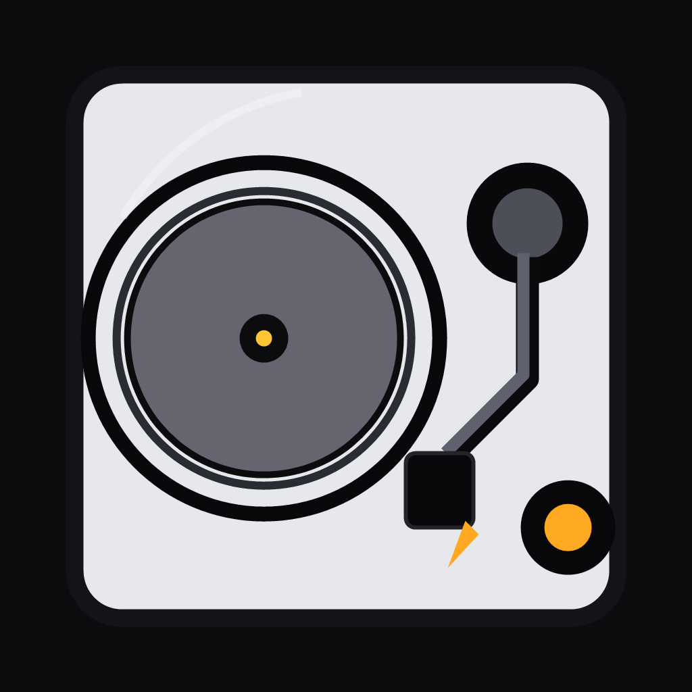
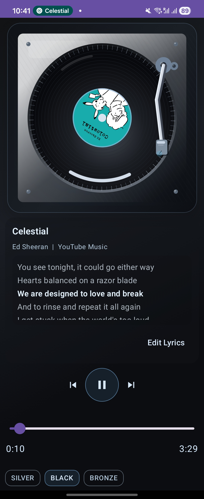

# PicklyDeck

Android turntable-style remote controller for Spotify, YouTube Music, and compatible Android media sessions.

## 1. Project Summary

PicklyDeck is a tactile UI experiment:
- Tonearm drag controls playback state (needle in/out)
- Platter animation and tonearm movement stay synced with media position
- Notification/lockscreen/widget controls mirror playback + tonearm intent
- Notification permission flow and in-app disclosure are built into the app setup

This app does not stream audio directly.  
It reads and controls active external media sessions via Android MediaSession/Notification Listener.  
PicklyDeck keeps playback metadata on-device and does not ship with online lyrics lookup.

## 2. Core Features

- Realistic turntable interaction
- Needle drag -> play/pause + seek mapping
- Platter spin-up/spin-down animation
- Tonearm 3-layer metallic lighting (base/shadow/highlight)
- Scratch SFX + haptic drop feedback
- Theme system: `AUTO`, `SILVER`, `BLACK`
- Deck visual modes: `TURNTABLE`, `CAMPFIRE`, `CD_PLAYER`
- Visualizer modes: `OFF`, `WAVE`, `SPECTRUM`
- Foldable presets
- Flip cover-style compact layout
- Flip open / phone / tablet adaptive layout
- External controls
- Notification + lockscreen transport actions
- Home screen widget actions

## 3. Tech Stack

- Kotlin
- Jetpack Compose (Material3)
- Android MediaSession / NotificationListenerService
- Coroutines + StateFlow
- Gradle (KTS)

## 4. Architecture

- `PicklyDeckViewModel`: playback state sync, needle/seek logic, external controls publish
- `MainActivity` + Compose UI: turntable rendering, gestures, responsive layout presets
- `ExternalMediaSessionController`: finds and prioritizes active player sessions
- `PicklyDeckExternalControls`: notification + widget rendering/actions
- `PlaybackMath`: shared playback-position and needle-mapping helpers

## 5. Run Locally

1. Open in Android Studio
2. Enable Notification Access for this app
3. On Android 13+, allow notifications so the ongoing controls notification can appear
4. Run:
   - `./gradlew :app:assembleDebug`
5. Install APK:
   - `app/build/outputs/apk/debug/app-debug.apk`

## 6. Portfolio Demo Checklist

- Needle rest -> needle in -> playback starts
- Seek slider updates tonearm position live
- Theme switch (`AUTO/SILVER/BLACK`) updates material look
- Foldable emulator: cover/open layout difference
- Notification + widget: prev/play-next + seek +/-10s + needle in/out control

## 7. Limitations

- Behavior depends on session metadata/actions exposed by each music app
- Some apps may not expose seek or full metadata
- Android notification access must stay enabled for the remote UI to work

## 8. Screenshots / Demo

### Main UI

### Flip Layout Demo

<video src="docs/video.mp4" controls width="360"></video>

If your Markdown viewer does not support inline video:

[Open Flip Layout Demo (MP4)](docs/video.mp4)

## 9. Privacy

- Privacy policy draft: `docs/PRIVACY_POLICY.md`
- Public GitHub Pages files live in the repository root `docs/` folder.
- Public privacy-policy URL:
  `https://minki-cho.github.io/Turn-table-Android-application/privacy-policy/`

## 10. Release Artifacts

- Signed release APK:
  - `app/build/outputs/apk/release/app-release.apk`
- Play bundle:
  - `app/build/outputs/bundle/release/app-release.aab`
- Signing config:
  - Gradle accepts either `keystore.properties` or `PICKLYDECK_*` environment variables for release signing.
